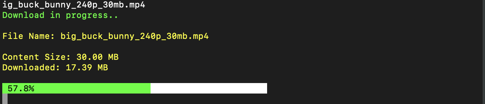

# KDM

**KDM** is a simple and lightweight **terminal-based downloader** built with **Compose**.

It allows you to easily download any file from a URL directly inside your terminal.



---

## How to Build

To package the application for your OS, run:

```bash
./gradlew packageUberJarForCurrentOS
```

This will generate an executable JAR file at:

```
composeApp/build/compose/jars/{yourJarFile}.jar
```

---

## How to Run

You can run the application with:

```bash
java -jar composeApp/build/compose/jars/{yourJarFile}.jar {url}
```

Example:

```bash
java -jar composeApp/build/compose/jars/ir.amirroid.kdm-macos-arm64-1.0.0.jar https://example.com/file.zip
```

---

## Using KDM Globally (Optional)

You can also make **KDM** globally accessible in your terminal by creating a simple launcher script:

1. Create a file named `kdm` with the following content:

    ```bash
    #!/bin/bash
    java -jar /path/to/ir.amirroid.kdm-macos-arm64-1.0.0.jar "$@"
    ```

2. Make the script executable:

    ```bash
    chmod +x kdm
    ```

3. Move it to `/usr/local/bin`:

    ```bash
    sudo mv kdm /usr/local/bin/
    ```

Now you can use `kdm` from anywhere:

```bash
kdm https://example.com/file.zip
```

---

## License

MIT License